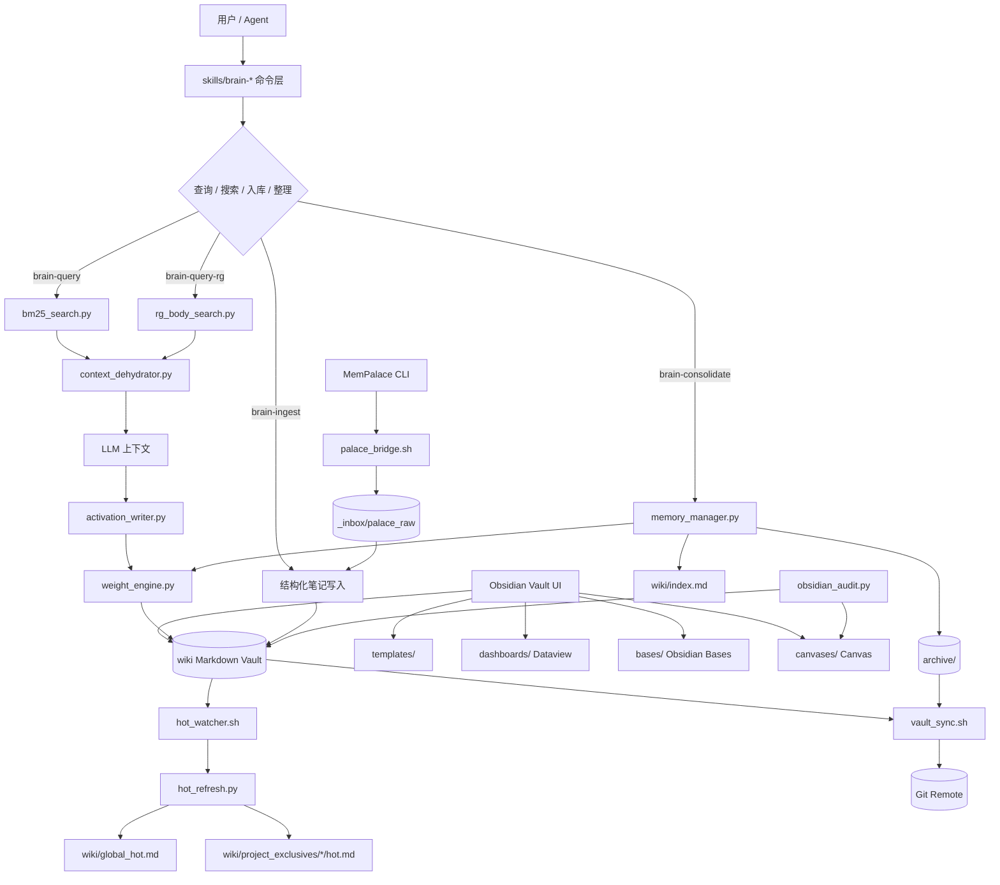
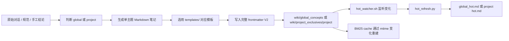
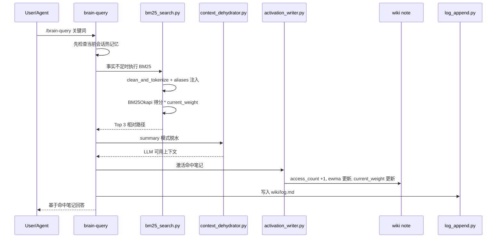
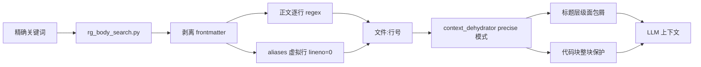
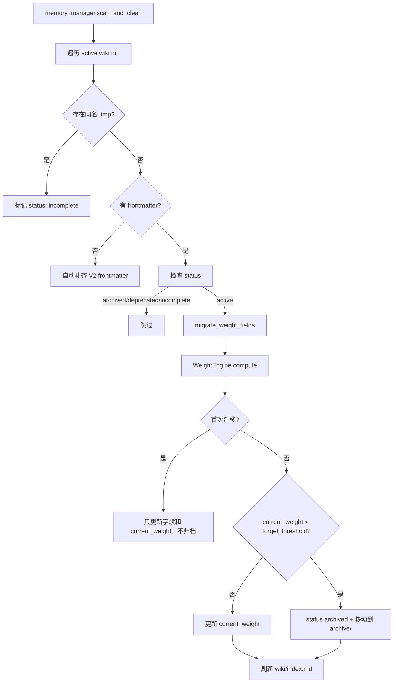
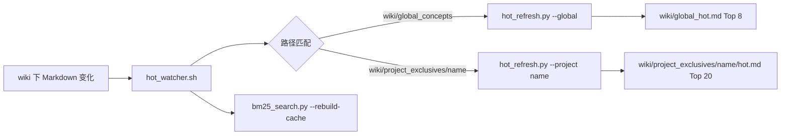

# 记忆仓库项目完整技术方案

**项目名**：member  
**仓库定位**：本地优先的 LLM 记忆仓库 / Obsidian 知识图谱操作系统  
**评审日期**：2026-06-06  
**代码依据**：`scripts/`、`skills/`、`wiki/project_exclusives/member/`、`tests/`、`templates/`、`dashboards/`、`bases/`、`canvases/`

## 1. 项目定位

该项目用于把 LLM 对话、项目经验、技术规范和历史上下文沉淀为可检索、可链接、可衰减的 Obsidian Wiki。系统以 Obsidian Vault 作为知识承载和治理界面，以 Python 脚本作为检索、激活、权重、归档和同步引擎，以 `skills/brain-*.md` 作为 Agent 侧命令编排层，以 `templates/`、`dashboards/`、`bases/`、`canvases/` 作为 Obsidian 原生 UX 层。

核心目标：

- 将一次性的 LLM 上下文沉淀为结构化 Markdown 笔记。
- 通过 BM25、rg、aliases 和权重模型实现低成本召回。
- 用 frontmatter 记录知识生命周期，按访问频率和时间自动衰减。
- 维护全局知识与项目专属知识隔离，避免跨项目上下文污染。
- 用 hot memory 文件提供常驻热知识索引。
- 用 Obsidian 原生插件（Dataview、Templater、Bases、Canvas）提供可视化治理界面。

## 2. 功能分层

```text
┌─────────────────────────────────────────────────────────────────┐
│  1. 交互命令层                                                    │
│  skills/brain-query.md, brain-query-rg.md, brain-search*.md,    │
│  brain-ingest.md, brain-consolidate.md                           │
├─────────────────────────────────────────────────────────────────┤
│  2. 检索召回层                                                    │
│  bm25_search.py, rg_body_search.py, context_dehydrator.py        │
├─────────────────────────────────────────────────────────────────┤
│  3. 激活与权重层                                                  │
│  activation_writer.py, weight_engine.py, memory_manager.py       │
├─────────────────────────────────────────────────────────────────┤
│  4. 热记忆层                                                      │
│  hot_watcher.sh, hot_refresh.py, global_hot.md, project hot.md   │
├─────────────────────────────────────────────────────────────────┤
│  5. Obsidian UX 层（新）                                          │
│  templates/, dashboards/, bases/, canvases/,                     │
│  snippets/memory-vault.css, obsidian_audit.py                    │
├─────────────────────────────────────────────────────────────────┤
│  6. 知识存储层                                                    │
│  wiki/global_concepts, wiki/project_exclusives, archive/,        │
│  _inbox, wiki/index.md, wiki/log.md                              │
├─────────────────────────────────────────────────────────────────┤
│  7. 外部桥接与同步层                                              │
│  palace_bridge.sh, vault_sync.sh, Git, MemPalace, Obsidian       │
└─────────────────────────────────────────────────────────────────┘
```

各层职责：

| 层级 | 职责 | 关键文件 |
| --- | --- | --- |
| 交互命令层 | 定义 Agent 使用流程、命令参数、成功标准和禁令 | `skills/brain-*.md` |
| 检索召回层 | 从知识库找候选笔记，并压缩为 LLM 可读上下文 | `bm25_search.py`、`rg_body_search.py`、`context_dehydrator.py` |
| 激活与权重层 | 刷新访问字段、计算权重、迁移 V2 schema、归档低权重笔记 | `activation_writer.py`、`weight_engine.py`、`memory_manager.py` |
| 热记忆层 | 根据权重和访问次数生成热榜，提供常驻上下文入口 | `hot_watcher.sh`、`hot_refresh.py` |
| Obsidian UX 层 | 提供 Dataview 治理看板、Templater 入库模板、Bases 属性视图、Canvas 系统地图和 CSS 视觉增强；`obsidian_audit.py` 供 Agent 读取 Canvas 节点、检测 alias 缺口和低权重候选 | `templates/`、`dashboards/`、`bases/`、`canvases/`、`obsidian_audit.py`、`.obsidian/snippets/memory-vault.css` |
| 知识存储层 | 存储全局/项目笔记、日志、索引、缓存和归档 | `wiki/`、`archive/`、`_inbox/` |
| 外部桥接与同步层 | 接入 MemPalace 历史会话，执行 Git 发布 | `palace_bridge.sh`、`vault_sync.sh` |

## 3. 系统架构图



## 4. 目录与数据模型

### 4.1 目录职责

```text
member/
├── skills/                          # Agent 命令说明与流程约束
├── scripts/                         # 本地执行引擎
│   ├── bm25_search.py
│   ├── rg_body_search.py
│   ├── context_dehydrator.py
│   ├── activation_writer.py
│   ├── weight_engine.py
│   ├── memory_manager.py
│   ├── hot_refresh.py
│   ├── hot_watcher.sh
│   ├── log_append.py
│   ├── frontmatter_utils.py
│   ├── obsidian_audit.py            # Canvas 节点读取 + alias 缺口 + 低权重候选
│   ├── palace_bridge.sh
│   ├── vault_sync.sh
│   └── utils.py
├── config/weight_config.yml          # V2 权重参数
├── tests/                           # 行为回归测试
├── templates/                        # Templater 入库模板
│   ├── concept-global.md
│   ├── concept-project.md
│   ├── decision.md
│   ├── pitfall.md
│   └── usage-manual.md
├── dashboards/                       # Dataview 治理看板
│   ├── 记忆治理总览.md
│   ├── 低权重待处理.md
│   ├── 最近激活.md
│   ├── 缺少 aliases.md
│   ├── 项目 member 记忆.md
│   ├── 归档候选.md
│   └── 链接治理.md
├── bases/                            # Obsidian Bases 属性视图
│   ├── active-memory.base
│   ├── project-memory.base
│   ├── archive-candidates.base
│   ├── recent-activations.base
│   └── alias-needed.base
├── canvases/                         # Canvas 系统地图
│   └── LLM-Brain-OS.canvas
├── wiki/
│   ├── global_concepts/              # 跨项目通用知识
│   ├── project_exclusives/<project>/ # 项目专属知识
│   ├── global_hot.md                 # 全局热记忆 Top 8（自动生成，禁止手动编辑）
│   ├── index.md                      # 中央索引
│   └── log.md                        # 查询日志，最多 50 条
├── archive/                          # 冷冻归档区，和 wiki 同级
│   ├── global_concepts/
│   └── project_exclusives/
└── _inbox/
    ├── palace_raw/                   # MemPalace 原始会话材料
    ├── global_shared_raw/            # 待注入全局 wing 的原始规范
    ├── .bm25_cache.pkl               # BM25 缓存
    └── .hot_refresh*.lock            # 各域热榜写锁
```

注意：实际归档目录是仓库根目录下的 `archive/`（含 `global_concepts/`、`project_exclusives/` 镜像子目录），`memory_manager.py` 中 `ARCHIVE_DIR = BRAIN_DIR / "archive"`，测试也按该路径验证。`wiki/archive/` 是 Obsidian 自动创建的空目录，不参与脚本逻辑。

### 4.2 笔记 frontmatter schema（V2）

```yaml
---
type: concept
created_at: 2026-06-06
last_modified: 2026-06-06
project: member
aliases: []
code_symbols: []
initial_weight: 1.0
current_weight: 1.0
last_activated: 2026-06-06
access_count: 1
status: active
superseded_by: ""
weight_schema_version: 2
category: general
importance: 1
ewma_access: 0.0
last_boost: 1.0
last_boosted_at: ""
last_weight_migrated_at: 2026-06-06
tags:
  - memory/active
  - type/concept
  - project/member
  - category/general
cssclasses:
  - memory-note
---
```

字段分组：

| 字段组 | 字段 | 作用 |
| --- | --- | --- |
| 基础身份 | `type`、`project`、`aliases`、`code_symbols` | 确定知识类型、归属和检索增强 |
| 生命周期 | `created_at`、`last_modified`、`last_activated`、`access_count`、`status` | 记录创建、更新、激活、活跃状态 |
| 权重 V1 兼容 | `initial_weight`、`current_weight` | 保留基础权重与排序权重 |
| 权重 V2 | `weight_schema_version`、`category`、`importance`、`ewma_access`、`last_boost`、`last_boosted_at`、`last_weight_migrated_at` | 支持类别半衰期、重要性、近期访问和 boost |
| 替代关系 | `superseded_by` | 标记废弃笔记的替代目标 |
| Obsidian 原生 | `tags`、`cssclasses` | 增强 graph 可视化、tag pane 分组和 CSS 视觉渲染 |

`tags` 约定结构：`memory/<status>`、`type/<type>`、`project/<project>`、`category/<category>`。  
`cssclasses` 约定值：`memory-note`（所有笔记）、`memory-hot`（热笔记）、`memory-cold`（冷笔记）、`memory-decision`（决策）、`memory-pitfall`（踩坑）。

## 5. 数据流转图

### 5.1 写入与入库数据流



设计要点：

- `brain-ingest` 要求一文一议，避免把多个主题塞入同一笔记。
- `templates/` 提供五种模板（concept-global、concept-project、decision、pitfall、usage-manual），所有模板携带完整 V2 frontmatter 和 Templater 动态日期，保证入库格式一致。
- `memory_manager._build_frontmatter()` 可为无 frontmatter 的旧文件自动补齐 V2 字段。
- `frontmatter_utils.atomic_write_text()` 使用 `fcntl` 独占锁和 `.tmp` 临时文件保障原子写入。

### 5.2 BM25 查询数据流



关键实现：

- `bm25_search.py` 用 `jieba` 分词和 `rank_bm25.BM25Okapi`。
- `aliases` 必须在剥离 frontmatter 前提取，并追加到 token 流。
- 最终排序为 `BM25 score * current_weight`。
- 跳过 `status: archived/deprecated/incomplete` 的笔记。
- 默认输出 Top 3，供命令层读取后脱水。

### 5.3 rg 精确查询数据流



适用场景：

- 已知道准确词汇、类名、技术名词或短语。
- 需要定位具体行号。
- 需要比 BM25 更精确的证据片段。

### 5.4 权重衰减与归档数据流



当前 V2 权重公式：

```text
effective_half_life = category_half_life * (1 + (importance - 1) * importance_k)
decay = 2 ^ (-days_idle / effective_half_life)
freq_bonus = min(1 + freq_k * log1p(ewma_access), freq_bonus_max)
boost = last_boost if boost_age_days <= boost_ttl_days else 1.0
current_weight = clamp(initial_weight * decay * freq_bonus * boost, weight_min, weight_max)
```

默认配置（`config/weight_config.yml`）：

| 配置项 | 默认值 | 含义 |
| --- | --- | --- |
| `category_half_life.strategy` | `90` 天 | strategy 类笔记半衰期 |
| `category_half_life.fact` | `60` 天 | fact 类笔记半衰期 |
| `category_half_life.decision` | `75` 天 | decision 类笔记半衰期 |
| `category_half_life.log` | `7` 天 | log 类笔记半衰期 |
| `category_half_life.spec` | `120` 天 | spec 类笔记半衰期 |
| `category_half_life.general` | `30` 天 | 未分类笔记半衰期 |
| `forget_threshold` | `0.15` | 低于该值进入冷冻归档 |
| `weight_min` | `0.01` | 权重下限 |
| `weight_max` | `5.0` | 权重上限 |
| `boost_ttl_days` | `7` | boost 有效期 |
| `ewma_half_life_days` | `14` | EWMA 访问事件半衰期 |
| `revive_weight_margin` | `0.05` | 归档复活权重余量（预留） |

### 5.5 热记忆刷新数据流



排序规则：

```python
notes.sort(key=lambda n: (n["weight"], n["access"]), reverse=True)
```

保护机制：

- 排除 `hot.md`、`global_hot.md`，避免 watcher 死循环。
- global 和 project 使用不同锁文件：
  - `_inbox/.hot_refresh_global.lock`
  - `_inbox/.hot_refresh_<project>.lock`
- `vault_sync.sh` 会等待 `.hot_refresh*.lock` 释放，最多等待 10 秒。

## 6. Obsidian UX 层详解

### 6.1 设计原则

Obsidian UX 层不干预脚本引擎，只读取 frontmatter properties 和文件系统。脚本引擎维护 frontmatter，Obsidian 插件读取展示，两者通过 Markdown 文件解耦。

- 不破坏现有 Python 脚本对 frontmatter 的读写。
- 不让 Agent 直接依赖 Dataview 运行结果。
- 不修改 `.obsidian/workspace.json`。

### 6.2 templates/（Templater 入库模板）

五种模板对应五类笔记，所有模板：

- 携带完整 V2 frontmatter（含 `tags`、`cssclasses`）。
- 用 `<% tp.date.now("YYYY-MM-DD") %>` 自动填充日期。
- 正文含标准结构（结论/边界/细节/关联）。
- 须在 Obsidian Templater 插件下使用。

| 模板文件 | 适用场景 |
| --- | --- |
| `concept-global.md` | 跨项目通用概念，`project: global` |
| `concept-project.md` | 项目专属概念，`project: member` |
| `decision.md` | 技术或产品决策记录 |
| `pitfall.md` | 踩坑记录 |
| `usage-manual.md` | 使用说明或操作手册 |

### 6.3 dashboards/（Dataview 治理看板）

七个 Dataview 看板，提供记忆健康度可视化：

| 看板文件 | 内容 |
| --- | --- |
| `记忆治理总览.md` | 活跃 Top 20 + 各子看板入口 |
| `低权重待处理.md` | `current_weight < 0.3` 的 active 笔记 |
| `最近激活.md` | 最近 7 天激活的笔记 |
| `缺少 aliases.md` | `aliases` 为空的 active 笔记 |
| `项目 member 记忆.md` | `project: member` 的全部 active 笔记 |
| `归档候选.md` | `current_weight < 0.15` 的笔记 |
| `链接治理.md` | 孤儿笔记（无出链）和弱连接笔记 |

所有看板仅在 Obsidian Dataview 插件下动态渲染，Agent 不直接依赖其输出。

### 6.4 bases/（Obsidian Bases 属性视图）

五个 `.base` 文件提供 Obsidian 原生属性表格视图（Obsidian 1.6+ Bases 功能）：

| 文件 | 过滤条件 |
| --- | --- |
| `active-memory.base` | `wiki/` 下 `status == active` |
| `project-memory.base` | `project == member` |
| `archive-candidates.base` | `current_weight < 0.15` |
| `recent-activations.base` | 按 `last_activated` 最近排序 |
| `alias-needed.base` | `aliases` 为空 |

每个 base 文件包含 `filters`、`properties`、`views` 三个顶级字段，`views[0].type` 均为 `table`。

### 6.5 canvases/（Canvas 系统地图）

`canvases/LLM-Brain-OS.canvas` 是系统架构可视化入口，包含：

- 至少 10 个节点（含 file 类型节点和 text 节点）。
- 至少 8 条边。
- 必须链接的核心文件：
  - `wiki/global_hot.md`
  - `wiki/project_exclusives/member/hot.md`
  - `wiki/project_exclusives/member/llm-brain-os-architecture.md`
  - `dashboards/记忆治理总览.md`
  - `docs/memory-repository-technical-solution.md`
  - `docs/memory-repository-user-manual.md`

### 6.6 obsidian_audit.py

供 Agent 读取 Obsidian-native 结构的 Python 脚本：

```bash
python3 scripts/obsidian_audit.py \
  --wiki-root wiki \
  --canvas canvases/LLM-Brain-OS.canvas \
  --threshold 0.3
```

输出 JSON，包含三个字段：

| 字段 | 含义 |
| --- | --- |
| `alias_gaps` | 没有设置 `aliases` 的 active 笔记列表 |
| `low_weight_candidates` | `current_weight < threshold` 的 active 笔记，按权重升序 |
| `canvas_files` | Canvas 中所有 file 类型节点的路径列表 |

### 6.7 snippets/memory-vault.css

`/.obsidian/snippets/memory-vault.css` 提供 CSS 视觉增强：

| 类名 | 视觉效果 |
| --- | --- |
| `.memory-note` | 用 accent 颜色标注 |
| `.memory-hot` | 左绿色边框（`color-green`） |
| `.memory-cold` | 降低不透明度（`0.78`） |
| `.memory-decision` | 左蓝色边框（`color-blue`） |
| `.memory-pitfall` | 左红色边框（`color-red`） |

该文件不写入 `.obsidian/appearance.json`，由用户在 Obsidian 设置中手动启用。

## 7. 关键功能模块子流程

### 7.1 `bm25_search.py`

子流程：

1. 解析查询词、`--project` 和 `--rebuild-cache`。
2. 收集 `global_concepts` 和项目范围下的 `.md` 文件。
3. 跳过 `status: archived/deprecated/incomplete`。
4. 根据文件路径集合和 mtime 判断 `_inbox/.bm25_cache.pkl` 是否需要重建。
5. `clean_and_tokenize()`：
   - 提取 `aliases`。
   - 剥离 frontmatter。
   - 去掉 HTML 注释和 Markdown 符号。
   - `jieba` 分词。
6. `BM25Okapi.get_scores()` 得到基础分。
7. 读取 `current_weight`，计算 `final_score = bm25_score * current_weight`。
8. 输出 Top 3 相对路径。

技术特点：

- 缓存结构简单，按 mtime 增量判断。
- 默认检索全活跃区，`--project` 时再按前缀过滤当前项目。
- cache 写入当前没有文件锁，适合单人本地使用；多人/并发场景需要增强。

### 7.2 `rg_body_search.py`

子流程：

1. 展开传入目录为 `.md` 文件列表。
2. 对每个文件先提取 `aliases`。
3. 剥离 frontmatter。
4. 用 `re.search(pattern, line, re.IGNORECASE)` 逐行匹配正文。
5. 将 aliases 作为虚拟行追加，命中时 `lineno=0`。
6. 输出 `file:lineno:line`。

技术特点：

- 不依赖系统 `rg`，实际是 Python regex body search。
- 前端命令文档称为 rg 路径，本质是"剥离 frontmatter 的正文精确检索"。
- 当前脚本本身不按 status 过滤，后续激活由 `activation_writer.py` 拒绝非 active 文件。

### 7.3 `context_dehydrator.py`

子流程：

1. 根据是否有真实命中行号选择模式：
   - 无行号或 `lineno=0`：summary 模式。
   - 有行号：precise 模式。
2. summary 模式：
   - 剥离 frontmatter。
   - 去掉 HTML 注释、死空格和多余空行。
   - 保留完整正文。
3. precise 模式：
   - 保护 `[[wikilink]]` 为占位符。
   - 建立 H1/H2/H3 标题层级快照。
   - 检测代码块范围。
   - 命中代码块时保留整块代码。
   - 命中普通段落时，从最近标题截到下一标题前。
   - 注入 `[Context Scope: stem -> H1 -> H2]` 面包屑。
   - 还原 wikilink。
4. `assemble_final_context()`：
   - 按 score 降序拼接。
   - 用 `len(chunk) / 3.5` 估算 token。
   - 首个文档超预算时截断保留，后续文档超预算时追加警告后停止。

### 7.4 `activation_writer.py`

子流程：

1. 校验路径：
   - 必须是 `.md`。
   - 不能是生成文件。
   - 必须存在。
   - resolve 后必须位于 `wiki/global_concepts` 或 `wiki/project_exclusives`。
2. 读取 frontmatter，缺失时失败。
3. 解析 `status`，拒绝 `archived/deprecated/incomplete`。
4. 补齐 V2 schema 字段。
5. 计算 `days_idle`、`access_count + 1` 和 boost。
6. 更新 EWMA：

```text
decayed = previous_ewma * 2 ^ (-days_since_activation / ewma_half_life_days)
ewma_access = min(ewma_max, decayed + 1.0)
```

7. 计算新 `current_weight`。
8. 用 `atomic_write_text()` 一次性写回全部字段。
9. 输出 JSON：`path`、`access_count`、`ewma_access`、`last_boost`、`current_weight`。

安全点：

- 软链逃逸会被拒绝。
- 归档/废弃/未完成笔记不能被普通查询激活。
- 手工 boost 会被限制在 `1.0..high_boost`。

### 7.5 `weight_engine.py`

子流程：

1. 加载 `config/weight_config.yml`，缺字段用 `DEFAULT_CONFIG` 补齐。
2. 校验配置合法性。
3. `build_metadata()` 从 frontmatter 生成 `NoteMetadata`。
4. 未知 `category` fallback 到 `general`。
5. 非法数字字段 fallback 到默认范围。
6. `WeightEngine.compute()` 计算并 clamp 权重。

技术特点：

- `PyYAML` 可用时使用 YAML 解析；不可用时有简单 fallback parser。
- V2 权重模型可配置，适合后续调整不同类型知识的半衰期。

### 7.6 `memory_manager.py`

子流程：

1. 遍历 `wiki/global_concepts` 和 `wiki/project_exclusives`。
2. 跳过 `hot.md`、`global_hot.md`、`index.md`、`log.md`。
3. 发现孤儿 `.tmp` 时标记 `status: incomplete`。
4. 无 frontmatter 时自动补齐 V2 schema。
5. 补齐 `status` 和 `superseded_by`。
6. 跳过非 active 状态。
7. 迁移 V2 权重字段。
8. 首次迁移只更新字段和权重，不归档，避免升级时批量移动旧笔记。
9. 非首次迁移且低于 `forget_threshold` 时：
   - 原文件写 `status: archived`。
   - 移动到根目录 `archive/` 下的镜像路径。
10. 非 dry-run 时刷新 `wiki/index.md`。

### 7.7 `hot_refresh.py` 与 `hot_watcher.sh`

子流程：

1. `hot_watcher.sh` 用 `fswatch` 监听 `wiki/` 下 `.md` 文件变化。
2. 排除 `hot.md` 和 `global_hot.md`。
3. 按路径分流：
   - `wiki/global_concepts/` -> `hot_refresh.py --global`
   - `wiki/project_exclusives/<name>/` -> `hot_refresh.py --project <name>`
4. `hot_refresh.py` 收集 active 笔记。
5. 按 `(current_weight, access_count)` 排序。
6. global 输出 Top 8，project 输出 Top 20。
7. 无笔记时写 skeleton。
8. 使用独占锁写入 hot 文件。
9. watcher 同时异步触发 `bm25_search.py --rebuild-cache`。

### 7.8 `obsidian_audit.py`

子流程：

1. 遍历 `wiki/` 下所有 `.md`，跳过 `hot.md`、`global_hot.md`、`index.md`、`log.md`。
2. 解析每个笔记的 frontmatter 和正文 wikilink。
3. `find_alias_gaps`：收集 `status == active` 且 `aliases` 为空的笔记。
4. `find_low_weight_candidates`：收集 `status == active` 且 `current_weight < threshold` 的笔记，按权重升序。
5. `load_canvas_file_nodes`：解析 Canvas JSON，提取所有 `type == file` 节点的路径。
6. 输出合并 JSON 报告。

### 7.9 `palace_bridge.sh`

子流程：

1. 通过 Git 根目录推断当前项目名。
2. 生成当前项目 wing：`wing_project_<project>`。
3. 执行 `mempalace mine ~/.claude/projects/ --wing ... --mode convos`。
4. 执行 `mempalace sweep ... --output-dir _inbox/palace_raw/ --format=md`。
5. 如果 `_inbox/global_shared_raw/` 有文件，则注入 `wing_global_shared`。

定位：

- 该脚本负责把历史会话和公共规范导入外部 MemPalace wing 与本地 inbox。
- 它不直接把原始对话变成结构化 wiki 笔记，仍需后续提炼入库。

### 7.10 `vault_sync.sh`

子流程：

1. 切到硬编码 `BRAIN_DIR`。
2. 设置 `merge.renormalize=true`。
3. 检查当前分支必须等于 `BRAIN_SYNC_BRANCH`，默认 `main`。
4. 检查所有 `_inbox/.hot_refresh*.lock` 是否被持有。
5. 等待热榜写入锁释放，最多 10 秒。
6. `git fetch origin`。
7. `git rebase origin/<branch>`。
8. 如果有变更：
   - `git add .`
   - 自动 commit。
   - `git push --force-with-lease`。

风险：

- 更适合单人私有 vault。
- 多人协作时，rebase 加 `force-with-lease` 仍可能产生协作冲突，需要更严格的分支策略。

## 8. 技术特点总结

| 特点 | 实现 | 价值 |
| --- | --- | --- |
| 本地优先 | Markdown + Git + Python 脚本 | 可审计、可离线、无数据库依赖 |
| 双检索路径 | BM25 宽召回 + rg 精确检索 | 兼顾语义覆盖与精确证据 |
| aliases 注入 | BM25 token 和 rg 虚拟行都注入别名 | 减少简称、英文名、中文名不一致导致的漏召回 |
| 上下文脱水 | summary / precise 双模式 | 降低 token 成本，提高上下文密度 |
| V2 权重模型 | 类别半衰期 + 重要性 + EWMA + boost | 热知识优先召回，冷知识自动下沉 |
| 原子写入 | `fcntl` 锁、`.tmp`、`os.replace`/`os.rename` | 降低并发写坏和半文件检索风险 |
| 双轨热记忆 | global Top 8 + project Top 20 | 常驻上下文按作用域隔离 |
| 生命周期管理 | active / archived / deprecated / incomplete | 明确知识状态，避免脏知识进入召回 |
| Obsidian UX 层 | templates + dashboards + bases + canvas + snippets | 人在 Obsidian 内可视化治理，不依赖额外工具 |
| Agent 审计脚本 | `obsidian_audit.py` JSON 输出 | Agent 可程序化读取 alias 缺口、低权重候选和 Canvas 结构 |
| Git 同步 | rebase + force-with-lease + 锁等待 | 适合个人知识库发布 |

## 9. 当前能力边界与风险

| 风险 | 当前事实 | 建议 |
| --- | --- | --- |
| 硬编码绝对路径 | 多个脚本写死 `/Users/za-stanlexu/Documents/member/member` | 后续抽象为 `BRAIN_DIR` 环境变量或配置文件 |
| BM25 无语义理解 | 依赖词频和 jieba 分词 | 强化 aliases，必要时引入 embedding 召回 |
| BM25 cache 无锁 | `_inbox/.bm25_cache.pkl` 重建未加文件锁 | 并发 watcher 场景增加 cache lock |
| rg 脚本不按 status 过滤 | `rg_body_search.py` 只做正文和 alias 匹配 | 在 rg 层增加 status 过滤，减少后续激活失败 |
| archive 无自动复活 | 默认检索不扫归档区，激活也拒绝 archived | 后续增加显式 `--include-archive` 与 `--revive` |
| watcher 依赖 macOS `fswatch` | Linux 不可直接运行 | Linux 用 `inotifywait` 替代或封装 watcher 适配层 |
| Obsidian UX 层依赖社区插件 | Dataview 和 Templater 不随 Obsidian 内置 | 核心链路不依赖插件，插件仅服务于人工治理界面 |
| CSS snippet 需手动启用 | `.obsidian/appearance.json` 不强制写入 | 用户在 Obsidian 设置 > Appearance > CSS snippets 中手动开启 |
| Git 同步偏个人场景 | 自动 rebase 和 force-with-lease | 多人协作前改为 PR / protected branch 流程 |

## 10. 推荐演进路线

1. 路径配置化：把硬编码 `BRAIN_DIR` 改为环境变量加默认值。
2. 检索状态一致性：让 `rg_body_search.py` 与 `bm25_search.py` 一样过滤非 active 笔记。
3. cache 加锁：为 `_inbox/.bm25_cache.pkl` 增加 `.bm25_cache.lock`。
4. 显式归档复活：实现 `--include-archive` 和 `--revive`，`revive_weight_margin` 字段已在 config 中预留。
5. Agent 治理闭环：让 Agent 定期运行 `obsidian_audit.py`，对 alias 缺口和低权重候选发起维护任务。
6. Linux watcher 适配：封装 `fswatch` / `inotifywait`。
7. 增加 smoke test：对 `brain-query` 的"检索 -> 脱水 -> 激活 -> 日志"链路做端到端测试。

## 11. 结论

当前记忆仓库已经形成完整闭环：知识写入、检索召回、上下文脱水、激活刷新、权重衰减、热记忆刷新、冷冻归档和 Git 同步都有对应实现与测试覆盖。在此基础上新增了 Obsidian UX 层，通过 templates、dashboards、bases、canvas 和 CSS snippets 让人工治理不再依赖命令行，并提供 `obsidian_audit.py` 作为 Agent 侧的程序化审计入口。

系统主要工程风险不是核心链路缺失，而是本地化假设较强（硬编码路径、macOS watcher、单人 Git 同步、cache 并发锁不足）。作为个人 LLM 记忆仓库已经可用；若要扩展到跨机器或多人协作，需要优先完成路径配置化、锁增强和同步策略收敛。
